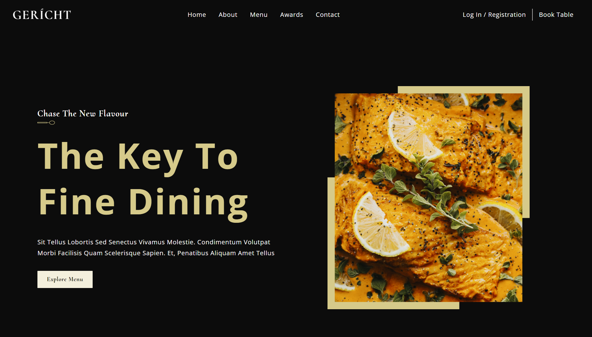

# Gericht Restaurant Project

## Overview

This project is a front-end implementation of an imaginary restaurant website. It serves as a showcase of my skills in React, JavaScript, and CSS. The site is hosted on Netlify, and you can access it [here](https://master--chipper-concha-7881a9.netlify.app/).

## Features

- Responsive design for a seamless experience on various screen sizes.
- React components for modular and efficient code organization.
- Simulated content representing an imaginary restaurant, including a menu, video section, about information, and a newsletter.

## Technologies Used

- React
- JavaScript
- CSS

## Getting Started

To run this project locally, follow these steps:

1. Clone the repository: `git clone https://github.com/your-username/imaginary-restaurant.git`
2. Navigate to the project directory: `cd imaginary-restaurant`
3. Install dependencies: `npm install`
4. Start the development server: `npm start`
5. Open your browser and visit `http://localhost:3000` to view the project locally.

## Deployment

The project is deployed on Netlify. Any changes pushed to the `main` branch will trigger an automatic deployment.

## Acknowledgments

- This project was created to demonstrate front-end development skills and showcase an imaginary restaurant concept.
- Thanks to [Netlify](https://www.netlify.com/) for providing free hosting services.

## License

This project is licensed under the MIT License - see the [LICENSE](LICENSE.md) file for details.

## Contact

Feel free to reach out with any questions or feedback:

- Email: kvitsianinika@gmail.com
- Twitter: [Kvitsianinika](https://twitter.com/Kvitsianinika)
- LinkedIn: [Nika Kvitsiani](https://www.linkedin.com/in/nika-kvitsiani/)
